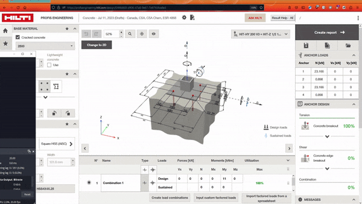

# Hilti-Profis-Help

1. First you need a Browser Extension for managing UserScripts[[1]][userscrips_faq] (skip if you already have one):  
   * Chrome: [Violentmonkey][chrome_violentmonkey] or [Tampermonkey][chrome_tampermonkey]
   * Firefox: [Greasemonkey][firefox_greasemonkey], [Tampermonkey][firefox_tampermonkey], or [Violentmonkey][firefox_violentmonkey]  
   * Opera: [Tampermonkey][opera_tampermonkey] or [Violentmonkey][opera_violentmonkey]
   * Brave: [Violentmonkey][chrome_violentmonkey] or [Tampermonkey][chrome_tampermonkey]
   * Edge: [Tampermonkey][edge_tampermonkey]  
   * Safari: ~[Tampermonkey][safari_tampermonkey]~ 
    
2. Install Hilti-Profis-Help:  
  [![][openuserjs_icon]][openuserjs_url]

1. Open <a href="https://profisengineering.hilti.com/" target="_blank">Hilti Profis Calculator</a> in your __browser__ and go to new or existing anchor design

2. Click the "Result Help" button that was added in the top right.

----
#### DISCLAIMER

> THE SOFTWARE AND ALL INFORMATION HERE IS PROVIDED "AS IS", WITHOUT WARRANTY OF ANY KIND, EXPRESS OR IMPLIED, INCLUDING BUT NOT LIMITED TO THE WARRANTIES OF MERCHANTABILITY, FITNESS FOR A PARTICULAR PURPOSE AND NONINFRINGEMENT. IN NO EVENT SHALL THE AUTHORS OR COPYRIGHT HOLDERS BE LIABLE FOR ANY CLAIM, DAMAGES OR OTHER LIABILITY, WHETHER IN AN ACTION OF CONTRACT, TORT OR OTHERWISE, ARISING FROM, OUT OF OR IN CONNECTION WITH THE SOFTWARE OR THE USE OR OTHER DEALINGS IN THE SOFTWARE.
>
> By using any code or information provided here you are agreeing to all parts of the above Disclaimer.

<!-- links -->
  [userscrips_faq]: https://en.wikipedia.org/wiki/Userscript
  [openuserjs_icon]: https://user-images.githubusercontent.com/3372598/166113714-5a2ede39-8d66-43a8-b5da-8f1897cb3121.png

<!-- Extensions -->
  [chrome_violentmonkey]: https://chrome.google.com/webstore/detail/violent-monkey/jinjaccalgkegednnccohejagnlnfdag
  [chrome_tampermonkey]: https://chrome.google.com/webstore/detail/tampermonkey/dhdgffkkebhmkfjojejmpbldmpobfkfo
  [firefox_greasemonkey]: https://addons.mozilla.org/firefox/addon/greasemonkey/
  [firefox_tampermonkey]: https://addons.mozilla.org/firefox/addon/tampermonkey/
  [firefox_violentmonkey]: https://addons.mozilla.org/firefox/addon/violentmonkey/
  [safari_tampermonkey]: https://github.com/victornpb/undiscord/issues/91#issuecomment-654514364
  [edge_tampermonkey]: https://microsoftedge.microsoft.com/addons/detail/tampermonkey/iikmkjmpaadaobahmlepeloendndfphd
  [opera_tampermonkey]: https://addons.opera.com/extensions/details/tampermonkey-beta/
  [opera_violentmonkey]: https://addons.opera.com/extensions/details/violent-monkey/

<!-- Download links -->
  [openuserjs_url]: <https://openuserjs.org/users/remaa> "https://openuserjs.org/users/remaa"
